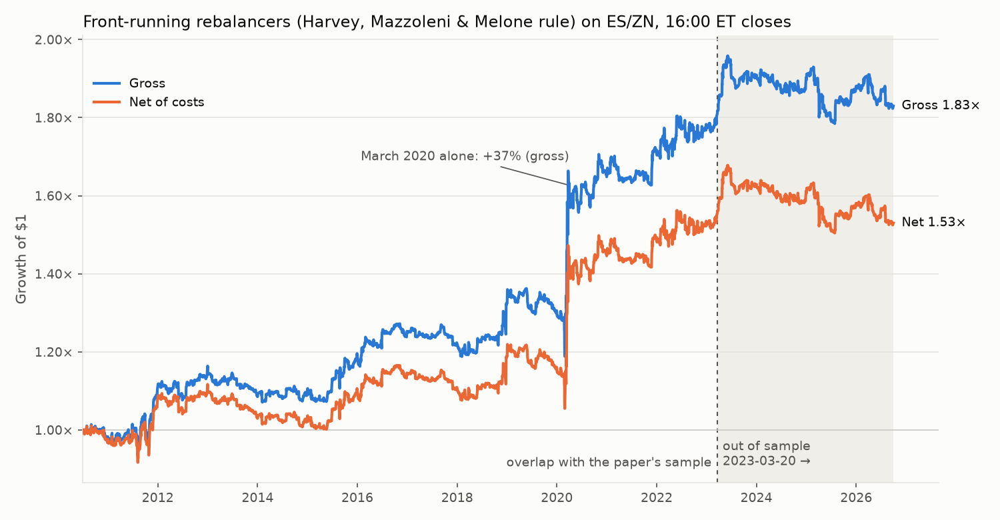

# Idea 3 — T+1 shift hunt + replication of Harvey, Mazzoleni & Melone (2025): results

(Sections 1–3 are filled in after the run. Section 4 "Spec choices" was written **before** `run.py` computed any
strategy return, signal-based statistic or window return.)

## 1. Plain-English summary

Funds that hold a fixed mix like 60% stocks / 40% bonds must sell whatever went up and buy whatever went down to get
back to 60/40. Harvey, Mazzoleni & Melone show you can trade just ahead of them, and report a Sharpe ratio of 1.11 for
1997–2023. (A Sharpe ratio is return per unit of risk; above 1 is excellent, and the paper finds 0.35 for simply holding
S&P 500 futures over the same years.) On our ES/ZN futures data the paper's rule did make money from July 2010 to March 2023 (Sharpe 0.57
before costs, 0.44 after), but more than half of that came from one month, March 2020; without it the result is not
distinguishable from luck (t = 1.3).

**3a verdict: weaker than published in-sample, and it does not hold out of sample.** In the 3½ years after the paper's
data ends (2023-03-20 → 2026-09-30) it roughly broke even (Sharpe 0.10 gross, −0.04 after costs, t = 0.2).

**3b verdict: WORTH A SECOND LOOK (t = −2.17), but most likely noise.** Month-end ES returns did shift the way the T+1
idea predicts after stocks moved to one-day settlement in May 2024. But every cross-check points the other way: the
same calculation around mid-month, where no settlement story applies, gives a gap just as large (t = −1.68). The
rebalancing-signed version shows nothing, and the 2017 switch from T+3 to T+2 shows no clear shift. With only 29 T+1
months, treat it as something to re-check in a year or two, not as a tradeable finding.

## 2. 3a — Replication of the front-running strategy

Strategy: each day at the 16:00 ET close, hold w_t dollars long ES and w_t dollars short ZN per dollar of capital,
w_t = ½·(−Threshold_t/1.5%) + ½·(modified Calendar_t). Daily returns, annualised with 252 days. "t (iid)" is the
t-stat of the mean daily return (≥ 2 means unlikely to be luck at roughly the 5% level); NW5 = Newey–West with 5 lags.
Cost drag = average yearly cost of trading (per side per unit of notional: ES ≈ 0.4–2.5 bp depending on the ES price
level, ZN 1.54 bp).

| strategy | period | kind | days | ann. ret % | vol % | Sharpe | skew | max DD % | t (iid) | t (NW5) | cost drag %/yr |
|---|---|---|---:|---:|---:|---:|---:|---:|---:|---:|---:|
| **combined** | (i) 2010-07-02 → 2023-03-17 | gross | 3192 | 5.04 | 8.83 | **0.57** | 6.80 | −12.8 | **2.03** | 2.17 | 1.20 |
| **combined** | (i) 2010-07-02 → 2023-03-17 | net | 3192 | 3.84 | 8.81 | 0.44 | 6.77 | −13.5 | 1.55 | 1.66 | 1.20 |
| **combined** | (i) excl. Mar 2020 | gross | 3170 | 2.43 | 6.77 | 0.36 | 1.07 | −16.5 | 1.27 | 1.32 | 1.20 |
| **combined** | (i) excl. Mar 2020 | net | 3170 | 1.24 | 6.75 | 0.18 | 1.02 | −17.4 | 0.65 | 0.68 | 1.20 |
| **combined** | **(ii) 2023-03-20 → 2026-09-30 (OOS)** | gross | 887 | 0.53 | 5.31 | **0.10** | 0.08 | −8.9 | **0.19** | 0.20 | 0.77 |
| **combined** | **(ii) 2023-03-20 → 2026-09-30 (OOS)** | net | 887 | −0.24 | 5.29 | −0.04 | 0.03 | −10.4 | −0.08 | −0.09 | 0.77 |
| combined | full 2010-07-02 → 2026-09-30 | gross | 4079 | 4.06 | 8.19 | 0.50 | 6.68 | −12.8 | 1.99 | 2.13 | 1.11 |
| combined | full 2010-07-02 → 2026-09-30 | net | 4079 | 2.95 | 8.17 | 0.36 | 6.64 | −13.5 | 1.45 | 1.56 | 1.11 |
| threshold only | (i) | gross | 3192 | 7.25 | 13.61 | 0.53 | 13.02 | −12.6 | 1.90 | 2.08 | 1.08 |
| threshold only | (i) | net | 3192 | 6.17 | 13.57 | 0.45 | 12.97 | −13.7 | 1.62 | 1.78 | 1.08 |
| threshold only | (i) excl. Mar 2020 | gross | 3170 | 2.92 | 7.49 | 0.39 | 0.05 | −12.6 | 1.38 | 1.62 | 1.08 |
| threshold only | (i) excl. Mar 2020 | net | 3170 | 1.89 | 7.47 | 0.25 | −0.03 | −13.7 | 0.90 | 1.05 | 1.08 |
| threshold only | (ii) OOS | gross | 887 | −2.01 | 6.28 | −0.32 | −3.47 | −11.9 | −0.60 | −0.72 | 0.60 |
| threshold only | (ii) OOS | net | 887 | −2.61 | 6.27 | −0.42 | −3.55 | −12.9 | −0.78 | −0.94 | 0.60 |
| calendar only | (i) | gross | 3192 | 2.84 | 10.23 | 0.28 | 0.51 | −21.4 | 0.99 | 0.99 | 1.49 |
| calendar only | (i) | net | 3192 | 1.34 | 10.23 | 0.13 | 0.43 | −22.3 | 0.47 | 0.47 | 1.49 |
| calendar only | (i) excl. Mar 2020 | gross | 3170 | 1.93 | 9.90 | 0.19 | 0.20 | −29.5 | 0.69 | 0.65 | 1.49 |
| calendar only | (i) excl. Mar 2020 | net | 3170 | 0.43 | 9.89 | 0.04 | 0.11 | −30.4 | 0.16 | 0.15 | 1.49 |
| calendar only | (ii) OOS | gross | 887 | 3.07 | 7.53 | 0.41 | 1.16 | −10.0 | 0.77 | 0.77 | 1.01 |
| calendar only | (ii) OOS | net | 887 | 2.07 | 7.51 | 0.28 | 1.10 | −10.4 | 0.52 | 0.52 | 1.01 |

Paper, for comparison (1997-09-10 → 2023-03-17, gross): 10.20% a year, 9.17% vol, Sharpe 1.11, skew 5.23. Net
Sharpe "close to 1". Sharpe 0.90 excluding Sep 2008–Mar 2009 and March 2020.

How to read it:
- **Same shape, half the return.** Our volatility (8.8% vs 9.2%) and the big positive skew (6.8 vs 5.2) match the
  paper; the return is about half (5.0% vs 10.2% a year). Positive skew means the profit comes in rare big bursts, and
  in our sample the burst is March 2020: +37% (compounded) in that single month, about half of all the gains in
  2010–2023. Without it, the Sharpe drops to 0.36 gross and 0.18 net, with t = 1.3 and 0.7.
- **Verdict (i), using the rule fixed before the run:** gross t = 2.03 ≥ 2 but Sharpe 0.57 < 0.7 → *weaker but
  present*. After costs it is no longer significant (t = 1.55). Our window has no 2008 crisis, which the paper says
  is a large contributor, so a lower number was expected. Even so, 0.57 is below the paper's own 0.90 excluding the
  crises.
- **Verdict (ii):** gross t = 0.19 (needs ≥ 2) and the net mean is negative → *does not clear the bar*. The Threshold
  part lost money out of sample (Sharpe −0.32). The month-end Calendar part kept a small positive return (Sharpe 0.41,
  t = 0.8), which is not significant. Gross P&L by year: 2023 +6.8%, 2024 −0.1%, 2025 −0.9%, 2026 −2.7% (through
  September). Power caveat (written before the run): even if the effect were fully intact, a 3½-year test would fail
  the t ≥ 2 bar about half the time. But a Sharpe of 0.10 is far below anything that would suggest the effect is
  intact.
- **Costs** take about 1.2% a year (≈ 42 units of notional traded per year). This is in line with the paper's own
  drop from gross to net.

Replication checks on the signals (are we computing what the paper computes?):

| check | ours (2010–2026) | paper (1997–2023) |
|---|---|---|
| Threshold rebalances/yr at δ = 1.1% / 2.5% | 10.4 / 2.5 | "about once a month" / "about once a quarter" |
| median rebalances/yr across the 26 δ | 7.9 | ≈ 16 |
| corr(Threshold, Calendar) | 0.62 | ≈ 0.60 |
| annual vol of the Threshold-only / Calendar-only strategies, period (i) | 13.6% / 10.2% | 11.6% / 11.6% |
| *diagnostic, not pre-registered:* paper-style regression of next-day (R_ES − R_ZN) on the signals (no controls), HC1 t | (i): Threshold −2.87, Calendar×week4 −1.13; (ii): Threshold +0.18, Calendar×week4 +0.36 | Threshold t > 4; Calendar×week4 strongly negative |

The signals behave as described. Our calmer sample (no 2000–02, no 2008) explains the lower rebalancing frequency.
In-sample, the Threshold signal still predicts the next day's stock-minus-bond return with the right sign (t = −2.9).
The end-of-month Calendar effect is weak, and out of sample both predictions disappear.

## 3. 3b — T+1 shift hunt

L = last trading day of the month. A "window" is the sum of ES daily returns (16:00 → 16:00) over 3 trading days, in
basis points (bp; 100 bp = 1%). Under T+2, a sale must happen by L−2 to settle by month-end, so the "dash for cash"
window is [L−4, L−2]. Under T+1 it should move one day later, to [L−3, L−1]. Regimes are assigned by each month's L.
T+3 = Jul 2010 – Aug 2017 (86 months; Sep and Dec 2014 dropped for vendor data gaps → 84 used). T+2 = Sep 2017 –
Apr 2024 (80). T+1 = May 2024 – Sep 2026 (29).

### 3.1 Primary test (pre-registered)

d_m = W[L−3, L−1] − W[L−4, L−2] per month (= r_{L−1} − r_{L−4}). Prediction: d is lower in T+1 than in T+2.

| regime | mean d_m (bp) | t | months |
|---|---:|---:|---:|
| T+2 | +28.4 | 1.84 | 80 |
| T+1 | −27.0 | −1.32 | 29 |
| **difference-in-differences (T+1 − T+2)** | **−55.4** | **Welch t = −2.17** (p two-sided 0.034) | 29 vs 80 |

**Verdict: WORTH A SECOND LOOK.** The sign is the predicted one, and −3 < t ≤ −2 maps to this verdict under the rule
fixed before the run. It clears the formal t ≥ 2 bar but not the t ≥ 3 "convincing" level that ~1,900 earlier tests
in this repo call for.

Where the difference comes from (bp per 3-day window, t in brackets):

| window | T+3 | T+2 | T+1 |
|---|---:|---:|---:|
| W[L−5, L−3] (T+3-aligned) | 4.8 (0.34) | 13.6 (0.47) | 39.0 (1.49) |
| W[L−4, L−2] (T+2-aligned) | 23.1 (1.56) | 14.4 (0.67) | 24.9 (1.06) |
| W[L−3, L−1] (T+1-aligned) | 40.7 (2.53) | 42.8 (1.95) | −2.1 (−0.07) |

About half of the DiD is the T+2 control's strong L−1 day (+32 bp, t = 2.46). The other half is a weak, insignificant
L−1 in T+1 (−9 bp). The T+1-aligned window lost its usual gain (−2 bp vs +41 to +43 bp in the earlier regimes). That
fits the story, but with 29 months the noise is about ±40 bp.

### 3.2 Robustness and placebo (reported; cannot rescue or overturn the primary)

| test | prediction | DiD (bp) | Welch t | n |
|---|---|---:|---:|---|
| PRIMARY: ES, T+1 vs T+2 | < 0 | −55.4 | −2.17 | 29 / 80 |
| y = −sign(Calendar_{t−1})·(R_ES − R_ZN), T+1 vs T+2 | > 0 | +1.0 | 0.03 | 29 / 80 |
| ES, T+2 vs T+3 (2017 natural experiment) | < 0 | −17.6 | −0.62 | 80 / 84 |
| y, T+2 vs T+3 | > 0 | −19.1 | −0.60 | 80 / 84 |
| **PLACEBO** mid-month anchor (last day ≤ 15th), ES, T+1 vs T+2 | none | **−61.9** | **−1.68** | 29 / 80 |
| PLACEBO mid-month, y, T+1 vs T+2 | none | −39.5 | −0.97 | 29 / 80 |
| PLACEBO mid-month, ES, T+2 vs T+3 | none | −34.5 | −1.35 | 80 / 86 |
| *post-hoc, not pre-registered:* drop one T+1 month at a time | — | −48 … −62 | −2.54 … −1.92 | 5 of 29 drops give t > −2 |

What this says:
- **The placebo is the key result.** The same before/after window comparison around the middle of the month, where
  settlement deadlines play no role, shows an equally large T+1-vs-T+2 gap (−62 bp, t = −1.7). So the primary result
  is most likely the T+1 period's extra noise (only 29 months), not a settlement effect.
- The rebalancing-signed version (y) shows no shift at all (t = 0.03). Under T+1, y is negative in every month-end
  window, which matches the 3a out-of-sample failure: since 2024, month-end prices have not moved the way rebalancing
  pressure would push them.
- The earlier natural experiment (T+3 → T+2 in 2017) has the predicted sign for ES but is tiny (t = −0.6), and the
  wrong sign for y.

### 3.3 Day-by-day profiles (mean bp per day, t-stat), k = 0 is L, +1/+2 = first two days of next month

N per cell: T+3 83–84, T+2 80, T+1 28–29 (the last month has no k = +1, +2 yet). Full table in `profiles.csv`.

| k | T+3 ES | t | T+2 ES | t | T+1 ES | t | T+3 y | t | T+2 y | t | T+1 y | t |
|---:|---:|---:|---:|---:|---:|---:|---:|---:|---:|---:|---:|---:|
| −10 | 18.8 | 2.24 | 20.6 | 1.60 | −7.7 | −0.53 | 6.3 | 0.61 | −5.8 | −0.38 | 6.4 | 0.43 |
| −9 | 11.9 | 1.15 | −10.0 | −0.80 | −14.6 | −0.91 | −2.9 | −0.24 | −14.5 | −1.10 | −30.4 | −2.03 |
| −8 | 8.6 | 0.92 | −5.1 | −0.45 | −15.2 | −0.93 | 1.0 | 0.10 | −12.8 | −1.00 | 8.9 | 0.60 |
| −7 | 7.7 | 0.87 | −12.9 | −1.08 | 5.1 | 0.31 | 4.5 | 0.46 | −12.8 | −0.90 | −9.2 | −0.64 |
| −6 | −0.1 | −0.01 | 1.0 | 0.10 | 12.0 | 0.78 | 16.0 | 1.27 | −9.0 | −0.79 | 13.5 | 0.96 |
| −5 | 5.0 | 0.55 | −4.0 | −0.24 | −0.7 | −0.04 | 0.0 | 0.00 | −4.1 | −0.22 | 10.1 | 0.54 |
| −4 | −12.2 | −1.20 | 3.6 | 0.30 | 17.7 | 1.32 | −8.5 | −0.69 | 5.6 | 0.43 | −11.7 | −0.84 |
| −3 | 11.9 | 1.33 | 14.0 | 0.93 | 22.0 | 1.65 | 3.6 | 0.32 | 1.2 | 0.07 | −17.8 | −1.53 |
| −2 | 23.4 | 2.13 | −3.2 | −0.25 | −14.8 | −1.20 | 32.7 | 2.58 | 9.5 | 0.70 | −11.2 | −0.93 |
| −1 | 5.4 | 0.75 | 32.0 | 2.46 | −9.2 | −0.63 | 18.1 | 2.06 | 18.2 | 1.33 | 2.0 | 0.12 |
| 0 | −2.1 | −0.20 | −11.6 | −1.01 | 21.9 | 1.32 | 14.4 | 1.20 | −4.2 | −0.36 | 17.8 | 1.16 |
| +1 | 16.3 | 1.31 | 19.5 | 1.53 | −15.7 | −1.01 | −39.6 | −2.64 | −15.0 | −1.11 | 5.1 | 0.25 |
| +2 | 2.7 | 0.31 | 12.3 | 0.91 | 13.5 | 0.84 | −1.2 | −0.11 | 20.1 | 1.31 | −3.1 | −0.16 |

There is no clean "selling-pressure trough" in any regime. Where a day stands out (T+3 at L−2, T+2 at L−1), it is a
*positive* ES return, closer to the classic turn-of-the-month rally than to a dash for cash. With 78 cells
(13 days × 2 outcomes × 3 regimes), a few |t| > 2 are expected by chance alone.

### 3.4 Files

- `run.py`: the whole pipeline (data → calendar → signals → 3a → 3b → outputs). `run_output.txt`: everything it
  printed.
- `daily.csv`: one row per trading day, with closes, returns, Threshold, Calendar, modified Calendar, position w,
  gross/cost/net and y.
- `monthly_windows.csv` (and `monthly_windows_placebo.csv`): one row per month, with window returns for ES and y and
  the two d's.
- `did_tests.csv`, `window_means_by_regime.csv`, `profiles.csv`: the 3b tables. `strategy_stats.csv`: the 3a table.
- `delta_diagnostics.csv`: rebalances per year for each δ. `roll_checks.csv`: every contract roll, with naive vs.
  roll-safe returns.
- `replication_equity.png`: growth of $1, gross and net, with the out-of-sample period shaded.

## 4. Spec choices, ambiguities and bug fixes

### 4.1 Written BEFORE running (2026-10-03)

What had been looked at beforehand: bar completeness (which hours exist on which days), the NYSE-calendar validation
below, and the roll-day returns of ES and ZN (to check the roll handling; this also printed each market's overall daily
mean/sd and largest moves). No signal, strategy return or month-end window return had been computed.

**Data**
1. ES: Databento GLBX.MDP3 `ohlcv-1h`, `ES.v.0` + `ES.v.1` (continuous, volume-ranked), 2010-06-07 → 2026-10-01,
   bought with `gqh.data.databento_chunked` after `gqh.data.price` for the full range said $1.878 (< $2.50 cap).
   17 yearly chunks, billed $0.07–$0.12 each, total ≈ $1.88. Nothing else was bought.
   ZN: the cached rates request (ZT/ZF/ZN/ZB/UB `.v.0/.v.1`, 2010-07-01 → 2026-10-01), `ZN.v.0` + `ZN.v.1` selected.
   **Joint sample starts 2010-07-01** (first ZN close) → first daily return 2010-07-02; last 2026-09-30.
2. Daily closes: `gqh.data.session_daily(bars, open_time="09:30", close_time="16:00")` on the raw (start-stamped)
   hourly bars. It keeps bars that *start* in [09:30, 16:00) → the 10:00 … 15:00 bars, so the close is the close of
   the bar *ending* 16:00 ET (same thing as the end-stamp convention: last bar end = 16:00). Checked in the data.
3. **Trading-day calendar (choice).** The simplest rule ("both ES and ZN have a bar ending 16:00") was rejected
   because it would mislabel month-ends that both 3a and 3b depend on: NYSE half-days (Black Friday was the last
   trading day of November in 2013, 2019 and 2024; ES stops at 13:15 ET), the ZN early close on 2010-12-31 (last
   day of Dec 2010) and a ZN vendor data hole on 2020-06-30 (last day of June 2020, no ZN bars after 11:00 ET).
   Instead: trading days = NYSE trading days (rule-based holidays incl. Good Friday, Juneteenth from 2022, and the
   special closures 2012-10-29/30, 2018-12-05, 2025-01-09) **that have at least one ES.v.0 and one ZN.v.0 bar in the
   09:30–16:00 window.** Validation: no non-NYSE weekday has an ES bar ending 16:00 (so the holiday list is right).
   On days whose last bar ends before 16:00 the close is that last bar: NYSE half-days (Black Friday, Dec 24, Jul 3:
   ES and ZN close ≈ 13:15–14:00 ET), ZN 2010-12-31 (14:00), ZN 2020-02-27 (14:00, data hole), ZN 2020-06-30 (11:00,
   data hole). Kept as is.
4. **Vendor data gaps.** No bars at all on 7 NYSE days: ES 2014-06-12, 2014-06-13, 2014-09-23, 2014-09-24,
   2014-09-25, 2014-12-31; ZN 2014-10-03. These days are dropped from the calendar (4,080 trading days remain of
   4,087); the next return spans the gap. L = last remaining trading day of the month, so December 2014's L is Dec 30
   (one day early). For 3b, a month is excluded if any return used in its windows spans a gap or if its NYSE month-end
   is missing → September 2014 and December 2014 (both T+3, so only the T+3 robustness test is affected).
5. Returns: `gqh.data.roll_safe_returns` on the `session_daily` rows (v.0 and v.1, trading days only). 65 rolls per
   market, all with a finite roll-safe return; checks in `roll_checks.csv`. ES/ZN futures returns are excess returns
   (no risk-free subtraction anywhere).

**3a. Replication**
6. Threshold (eq. B.1), literal: w_{t+1} = 60% if |w_t − 60%| ≥ δ, else the drifted weight
   w_t(1+R_ES)/(w_t(1+R_ES)+(1−w_t)(1+R_ZN)); signal^δ_{t+1} = drifted weight − 60% (computed before any reset).
   So the rebalancer resets on the day *after* the breach (as the pre-registration says). δ ∈ {0.0%, 0.1%, …, 2.5%}
   (26 values); Threshold_t = their plain average. Start w = 60% on 2010-07-01; signal = 0 on that day.
7. Calendar (eq. B.2), literal: w_{t+1} = 60% if t is L, else drifted; Calendar_{t+1} = drifted weight − 60%.
   Consequence of the literal formula: on the first trading day of a month (F) the Calendar signal still carries the
   previous month's drift (the reset shows from F+1). The strategy never uses Calendar_F itself (it uses Calendar_t for
   t in the last 5 days and Calendar_{t−4} on F), so this only matters for the y_t profile at k = +2.
8. Modified Calendar: sign(−Calendar_t) if t is one of the last 5 trading days of the month (L−4 … L);
   sign(Calendar_{t−4}) on F, t−4 = four trading days earlier (= L−3 of the previous month); 0 otherwise.
9. Position w_t = ½·(−Threshold_t / 1.5%) + ½·modCalendar_t. Return_{t+1} = w_t × (R_ES,t+1 − R_ZN,t+1), i.e. w_t
   dollars long ES and w_t dollars short ZN per dollar of capital, set at the 16:00 close of t.
10. Costs (choice): per side, per unit of notional traded on each leg. ES: `futures_cost_bps(ES.v.0 close that day,
    0.25, 50, fee_per_contract=1.5)` — the actual daily ES price (≈ 2.5 bp/side in 2010, ≈ 0.4 bp in 2026; the
    alternative was a fixed 4,500 = 0.62 bp, which would understate early costs). ZN: `futures_cost_bps(111, 1/64,
    1000, 1.5)` = 1.54 bp fixed. Cost_t = |w_t − w_{t−1}| × (c_ES,t + c_ZN), charged on day t (the trade day);
    the first position is bought from 0. Fractional contracts (notional-based), no rounding.
11. Statistics on daily returns: annual return = mean × 252; vol = sd × √252; Sharpe = ratio; skew = sample skewness
    of daily returns; max drawdown on the compounded curve Π(1+r); t-stat of the mean = mean / (sd/√n) (plain; days
    don't overlap), Newey–West (5 lags) t also shown. Periods by return date: (i) 2010-07-02 → 2023-03-17,
    (ii) 2023-03-20 → 2026-09-30. Signals run continuously (no restart at the out-of-sample start). Components:
    Threshold-only (w = −Threshold/1.5%) and Calendar-only (w = modCalendar), each standalone at full weight with its
    own costs (the combined strategy is their 50/50 average). "Excluding Mar 2020" drops every return dated in March
    2020 from period (i).
12. Verdict rules for 3a (fixed now): **out-of-sample holds** if period (ii) has gross t ≥ 2.0 and a positive net
    mean (the shared pass bar); t ≥ 3 would be "convincing". **In-sample matches the paper** if period (i) gross
    Sharpe ≥ 0.7 with t ≥ 2 (the paper: 1.11 over 1997–2023, 0.90 excluding the GFC and March 2020; our sample has
    no GFC); "weaker but present" if t ≥ 2 but Sharpe < 0.7; "does not replicate" if t < 2.
    Power note written in advance: 3.5 years out of sample at the paper's Sharpe of 1.1 gives an expected t ≈ 2.0,
    so even a fully intact effect fails the bar about half the time.

**3b. T+1 shift hunt**
13. Regime of a month = settlement cycle in force on its L: T+3 if L ≤ 2017-09-04, T+2 if 2017-09-05 ≤ L ≤
    2024-05-27, T+1 if L ≥ 2024-05-28. So September 2017 is T+2 and May 2024 is T+1 (its L−3 … L−1 = May 28–30 are
    all T+1 trade dates).
14. Window return W[L−a, L−b] = sum of ES daily returns dated L−a … L−b (each 16:00 → 16:00), in bp. Sum rather
    than compounded so windows add up exactly; the difference is negligible for 3-day returns.
15. Primary: d_m = W[L−3, L−1] − W[L−4, L−2] (the windows share L−3 and L−2, so d_m = r_{L−1} − r_{L−4}).
    DiD = mean over T+1 months − mean over T+2 months; Welch t; prediction DiD < 0.
    Verdict mapping (fixed now): t ≤ −3 → PASS (convincing); −3 < t ≤ −2 → WORTH A SECOND LOOK (clears the formal
    t ≥ 2 bar but not the t ≥ 3 "convincing" level given ~1,900 earlier tests); t > −2 → FAIL. 3b defines no trade,
    so the net-of-cost condition does not apply.
16. Robustness (reported, cannot rescue the primary):
    a. y_t = −sign(Calendar_{t−1}) × (R_ES,t − R_ZN,t) in place of R_ES; y > 0 means prices moved the way rebalancing
       pressure pushes them, so the prediction for y is DiD **> 0**.
    b. T+3 → T+2 (2017): d'_m = W[L−4, L−2] − W[L−5, L−3]; DiD = mean(T+2) − mean(T+3); prediction < 0 for ES
       (> 0 for y).
    c. Day-by-day profiles k = −10 … +2 per regime (k = 0 is L, +1 = first trading day of the next month): mean ES
       return (bp), t, N; same for y. Day values whose return spans a data gap are dropped, and the two months
       excluded in item 4 (Sep 2014, Dec 2014) are left out of the profiles too (their trading-day positions no
       longer line up with NYSE positions). The 3a strategy simply runs through the gaps on the remaining days.
    d. Each regime's mean of each window (the pieces of the DiD).
    e. Placebo (shared convention): the same DiD with the anchor M = last trading day on or before the 15th of each
       month in place of L. No prediction (should be ≈ 0).

### 4.2 After the run: checks, changes and bug log

- **Roll checks** (`roll_checks.csv`): 65 rolls per market. On a roll day the roll-safe return compares the new contract
  with its own previous close. The naive (front-to-front) return differs by the calendar spread: for ES −65 to +125 bp
  (mean +6 bp), for ZN −126 to +73 bp (mean −28 bp). The largest roll-day roll-safe returns are genuine market moves:
  ES −5.5% on 2020-03-18 and ZN +0.85% on 2022-02-28. No NaN returns except the first day. No giant jumps: the largest
  |ES| daily returns are all March 2020 or 2025-04-09; the largest |ZN| is 1.8%.
- **Bugs:** none found after the first run. The day-by-day timing of Threshold, Calendar and modified Calendar was
  checked by hand around March/April 2016. Good Friday is correctly skipped. The last 5 days get sign(−Calendar), and F
  gets sign(Calendar four trading days earlier).
- **Changes after the first run (no parameter touched):** (1) chart cosmetics: linear instead of log axis (log showed
  no tick labels over a 0.9–2× range), labels moved off the lines, and a March 2020 annotation. (2) Added a printed
  post-hoc leave-one-T+1-month-out check, labelled as not pre-registered. (3) Added a printed diagnostic predictive
  regression and a by-year P&L, also labelled as not pre-registered. All numbers in sections 2–3 are unchanged across
  these reruns.
- **Not done:** no other data bought, nothing outside `alpha_ideas/t1_shift/` modified, and no git changes.
