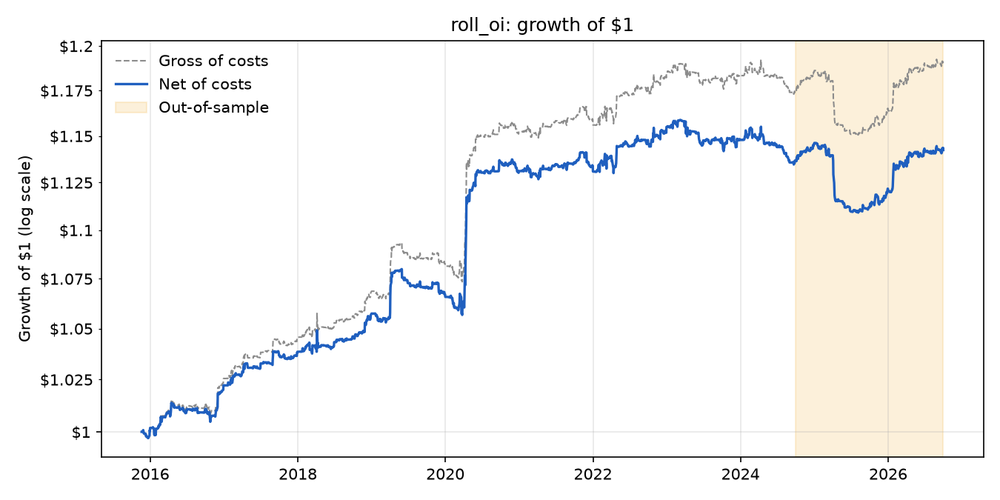
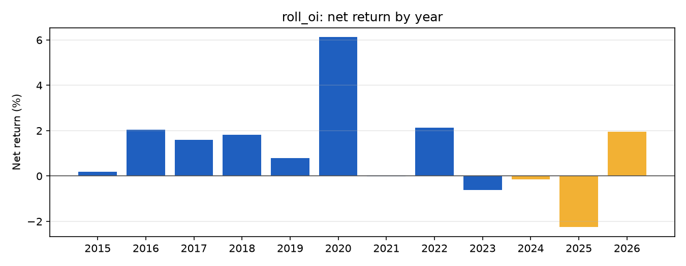
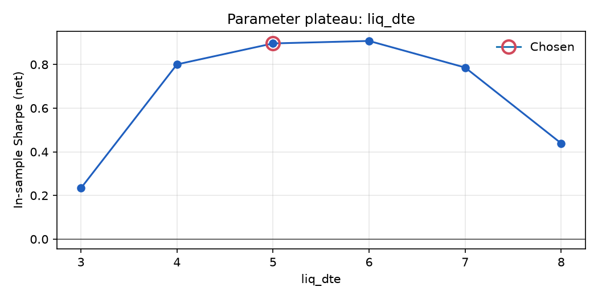

# roll_oi: results

Generated 2026-10-02 22:51 by `run_all.py --final`. Params: `{"legs": "RL", "sizing": "residual", "roll_dte": 25, "liq_dte": 5, "cycles": 24}`. Costs: per asset: CL.c.0 1.8, CL.c.1 1.8, HO.c.0 0.64, HO.c.1 0.64, RB.c.0 0.73, RB.c.1 0.73, NG.c.0 4.2, NG.c.1 4.2, HE.c.0 3.7, HE.c.1 3.7, GF.c.0 1.2, GF.c.1 1.2 bps per side.

Out-of-sample starts 2024-09-30 (most recent 20% or 2 years, whichever is shorter).

Out-of-sample status: **first evaluation** (evaluations so far: 1).

## Hypothesis timing

`hypotheses/roll_oi.md` first committed: **NOT COMMITTED**. First logged backtest on this machine: 2026-10-02T22:39:48.

## Data checks

|  | obs | missing | moves_over_25% | largest_move | longest_flat_run |
|---|---|---|---|---|---|
| CL.c.0 | 2729 | 0.2% | 2 | 54.7% | 1 |
| CL.c.1 | 2600 | 4.9% | 0 | 24.4% | 1 |
| HO.c.0 | 2731 | 0.1% | 0 | 21.9% | 1 |
| HO.c.1 | 2601 | 4.9% | 0 | 19.4% | 1 |
| RB.c.0 | 2731 | 0.1% | 2 | 32.0% | 1 |
| RB.c.1 | 2601 | 4.9% | 0 | 23.2% | 1 |
| NG.c.0 | 2731 | 0.1% | 3 | 28.9% | 1 |
| NG.c.1 | 2600 | 4.9% | 0 | 21.2% | 1 |
| HE.c.0 | 2733 | 0.0% | 0 | 10.0% | 1 |
| HE.c.1 | 2646 | 3.2% | 0 | 10.1% | 2 |
| GF.c.0 | 2733 | 0.0% | 0 | 5.7% | 2 |
| GF.c.1 | 2647 | 3.2% | 0 | 5.7% | 1 |

- Flag: CL.c.0: 2 single-period moves over 25% (unadjusted split? bad tick? roll gap?)

- Flag: RB.c.0: 2 single-period moves over 25% (unadjusted split? bad tick? roll gap?)

- Flag: NG.c.0: 3 single-period moves over 25% (unadjusted split? bad tick? roll gap?)

## Lookahead check

Weights recomputed on truncated data match the full-data weights: **PASS** (max difference 0.00e+00).

## Performance (net of costs unless marked gross)

|  | In-sample, gross | In-sample | Out-of-sample | In-sample, costs x2 | Out-of-sample, costs x2 |
|---|---|---|---|---|---|
| ann_return | 1.8% | 1.5% | 0.3% | 1.1% | -0.1% |
| ann_vol | 1.6% | 1.6% | 1.3% | 1.6% | 1.3% |
| sharpe | 1.13 | 0.90 | 0.20 | 0.66 | -0.10 |
| sharpe_95ci | [0.47, 1.79] | [0.24, 1.55] | [-1.18, 1.59] | [0.01, 1.32] | [-1.49, 1.28] |
| max_drawdown | -1.8% | -2.1% | -3.2% | -2.7% | -3.5% |
| max_dd_days | 345 days | 569 days | 630 days | 580 days | 637 days |
| turnover | 18.7x/yr | 18.7x/yr | 18.8x/yr | 18.7x/yr | 18.8x/yr |
| worst_day | -0.7% | -0.7% | -0.7% | -0.7% | -0.7% |
| worst_month | -0.5% | -0.6% | -2.1% | -0.6% | -2.2% |
| skew | 7.04 | 7.00 | 0.59 | 6.93 | 0.61 |
| n_obs | 2,231 | 2,231 | 503 | 2,231 | 503 |

## Exposure (risk actually carried)

|  | In-sample | Out-of-sample |
|---|---|---|
| avg_gross | 0.22 | 0.22 |
| max_gross | 1.19 | 0.81 |
| avg_net | 0.00 | 0.00 |
| max_position | 0.17 | 0.17 |
| time_in_market | 0.90 | 0.92 |

## Net return by year

| ts_event | net_return |
|---|---|
| 2015 | 0.2% |
| 2016 | 2.0% |
| 2017 | 1.6% |
| 2018 | 1.8% |
| 2019 | 0.8% |
| 2020 | 6.1% |
| 2021 | -0.0% |
| 2022 | 2.1% |
| 2023 | -0.6% |
| 2024 | -0.1% |
| 2025 | -2.3% |
| 2026 | 2.0% |

## Plateau: liq_dte

| liq_dte | in_sample_sharpe |
|---|---|
| 3 | 0.23 |
| 4 | 0.80 |
| 5 | 0.90 |
| 6 | 0.91 |
| 7 | 0.79 |
| 8 | 0.44 |

## Variants tried

Distinct configurations in this machine's ledger: **46**. Add your teammates' counts (`uv run python -m gqh.ledger`) for the total you disclose.

Deflated Sharpe Ratio (in-sample, 46 trials): **0.47**, the probability the true Sharpe is above what the luckiest of 46 zero-edge variants would show.

## Factor exposure (Ken French daily factors, Newey-West t-stats)

**In-sample** (R² 0.01, 2228 days)

|  | coef | t_stat |
|---|---|---|
| alpha (ann.) | 0.014 | 2.253 |
| Mkt-RF | 0.006 | 1.398 |
| SMB | -0.002 | -0.857 |
| HML | -0.002 | -0.472 |
| Mom | -0.001 | -0.580 |

**Out-of-sample** (R² 0.01, 481 days)

|  | coef | t_stat |
|---|---|---|
| alpha (ann.) | 0.002 | 0.175 |
| Mkt-RF | 0.005 | 0.488 |
| SMB | -0.011 | -0.854 |
| HML | -0.001 | -0.088 |
| Mom | -0.002 | -0.575 |

## Capacity (square-root impact model)

Inputs: aum=1e+07, names=12, turnover=18.67, gross_sharpe=1.129, strategy_vol=0.01627, fixed_bps=2.032, daily_vol=0.01876, adv_per_name=6.7e+07

Net Sharpe at $10,000,000: **0.24** (cost 7.7 bps/trade, 0.09% of ADV). Edge half gone near **$2,567,178**; capacity (net Sharpe 0) about **$18,772,639**.
