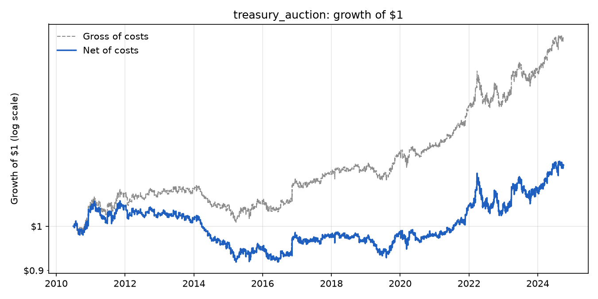
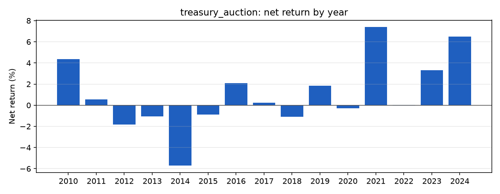
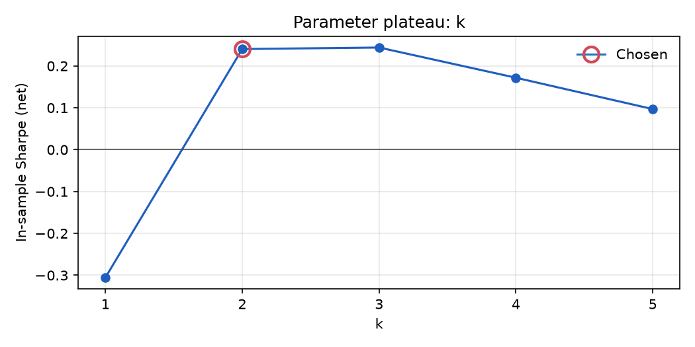

# treasury_auction: results

Generated 2026-10-02 21:59 by `run_all.py`. Params: `{"k": 2, "post": false, "size": "equal", "min_size": 0.0, "placebo_shift": 0}`. Costs: per asset: ZT.v.0 0.45, ZF.v.0 0.86, ZN.v.0 1.5, ZB.v.0 2.8, UB.v.0 2.6 bps per side.

Out-of-sample starts 2024-10-01 (most recent 20% or 2 years, whichever is shorter).

Out-of-sample: **locked** (run with `--final` once, at the end).

## Hypothesis timing

`hypotheses/treasury_auction.md` first committed: **NOT COMMITTED**. First logged backtest on this machine: 2026-10-02T21:35:29.

## Data checks

|  | obs | missing | moves_over_25% | largest_move | longest_flat_run |
|---|---|---|---|---|---|
| ZT.v.0 | 83808 | 0.6% | 0 | 0.5% | 15 |
| ZF.v.0 | 84006 | 0.3% | 0 | 0.9% | 7 |
| ZN.v.0 | 84133 | 0.2% | 0 | 1.5% | 7 |
| ZB.v.0 | 83997 | 0.3% | 0 | 3.4% | 5 |
| UB.v.0 | 82528 | 2.1% | 0 | 5.8% | 5 |

- Flag: ZT.v.0: 15 consecutive unchanged prices (stale data?)

- Flag: ZF.v.0: 7 consecutive unchanged prices (stale data?)

- Flag: ZN.v.0: 7 consecutive unchanged prices (stale data?)

- Flag: ZB.v.0: 5 consecutive unchanged prices (stale data?)

- Flag: UB.v.0: 5 consecutive unchanged prices (stale data?)

## Lookahead check

Weights recomputed on truncated data match the full-data weights: **PASS** (max difference 0.00e+00).

## Performance (net of costs unless marked gross)

|  | In-sample, gross | In-sample | In-sample, costs x2 |
|---|---|---|---|
| ann_return | 2.6% | 0.8% | -0.9% |
| ann_vol | 3.7% | 3.7% | 3.7% |
| sharpe | 0.70 | 0.24 | -0.22 |
| sharpe_95ci | [0.23, 1.17] | [-0.23, 0.71] | [-0.69, 0.25] |
| max_drawdown | -8.1% | -13.3% | -25.7% |
| max_dd_days | 1,016 days | 4,031 days | 4,983 days |
| turnover | 206.3x/yr | 206.3x/yr | 206.3x/yr |
| worst_day | -1.7% | -1.7% | -1.7% |
| worst_month | -3.7% | -3.8% | -4.0% |
| skew | 1.20 | 1.08 | 0.95 |
| n_obs | 4,424 | 4,424 | 4,424 |

## Exposure (risk actually carried)

|  | In-sample |
|---|---|
| avg_gross | 0.95 |
| max_gross | 5.85 |
| avg_net | -0.95 |
| max_position | 3.32 |
| time_in_market | 0.39 |

## Net return by year

| ts_event | net_return |
|---|---|
| 2010 | 4.4% |
| 2011 | 0.6% |
| 2012 | -1.8% |
| 2013 | -1.1% |
| 2014 | -5.7% |
| 2015 | -0.9% |
| 2016 | 2.1% |
| 2017 | 0.2% |
| 2018 | -1.1% |
| 2019 | 1.8% |
| 2020 | -0.3% |
| 2021 | 7.4% |
| 2022 | 0.0% |
| 2023 | 3.3% |
| 2024 | 6.5% |

## Plateau: k

| k | in_sample_sharpe |
|---|---|
| 1 | -0.31 |
| 2 | 0.24 |
| 3 | 0.24 |
| 4 | 0.17 |
| 5 | 0.10 |

## Variants tried

Distinct configurations in this machine's ledger: **20**. Add your teammates' counts (`uv run python -m gqh.ledger`) for the total you disclose.

Deflated Sharpe Ratio (in-sample, 20 trials): **0.18**, the probability the true Sharpe is above what the luckiest of 20 zero-edge variants would show.

## Factor exposure (Ken French daily factors, Newey-West t-stats)

**In-sample** (R² 0.04, 3585 days)

|  | coef | t_stat |
|---|---|---|
| alpha (ann.) | 0.001 | 0.092 |
| Mkt-RF | 0.044 | 7.780 |
| SMB | -0.014 | -1.858 |
| HML | 0.037 | 4.780 |
| Mom | 0.004 | 0.702 |
